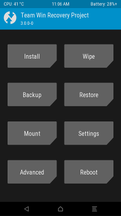

##### Team Win Recovery Project 3.x, or twrp3 for short, is a custom recovery built with ease of use and customization in mind. Its a fully touch driven user interface no more volume rocker or power buttons to mash. The GUI is also fully XML driven and completely theme-able. You can change just about every aspect of the look and feel.

    * Your warranty is now void.
    * I am not responsible for bricked devices, dead SD cards,
    * thermonuclear war, or your getting fired because the alarm app failed. Please
    * do some research if you have any concerns about features included in this ROM
    * before flashing it! YOU are choosing to make these modifications, and if
    * you point the finger at me for messing up your device, I will laugh at you.

Supported Models
-------------
Galaxy S21 Ultra (Exynos): G998B and G998N.

Download & Guide
-------------
                
1. Unlock your bootloader.
2. Downloads for Galaxy S21 Ultra (Exynos): [p3s](https://www.androidfilehost.com/?w=files&flid=323256)
3. Reboot to download mode
4. Uncheck auto reboot in Odin and flash TWRP in AP slot and [vbmeta_disabled.tar](https://github.com/afaneh92/android_device_samsung_p3s/raw/github.io/docs/vbmeta_disabled.tar) in USERDATA slot.
5. Hold volume down and power until the screen goes black then immediately switch to holding volume up and power to reboot into TWRP.
6. Disable encryption:
    - Go to Advanced > Terminal, type: multidisabler.​
    - If vendor complain about free space left on device, will attempt to resize vendor. and it ask to " - Run multidisabler again!."​
    - Type: multidisabler again. will see " - Finished." when done.​
    - Go back to Wipe > format data, and type "yes" to confirm.​
    - Reboot to TWRP recovery.​
7. Flash magisk (Optional)
8. Reboot to system, Enjoy.
                
Support
-------------
Live support is available via #twrp on Freenode with your IRC client or just [click this link](http://webchat.freenode.net/?channels=twrp).

[Telegram group](https://t.me/joinchat/H7UFBxjpms2aubmO)

Bugs
-------------
- Encryption not fully working.
     

Thanks
-------------
* TWRP team
* @ianmacd for multidisabler.
* Donators.

Sources
-------------
[Kernel tree](https://github.com/afaneh92/android_kernel_samsung_exynos2100)

[Device tree](https://github.com/afaneh92/android_device_samsung_p3s)

Changelog
-------------
[GitHub History](https://github.com/afaneh92/android_device_samsung_p3s/commits/android-11)
